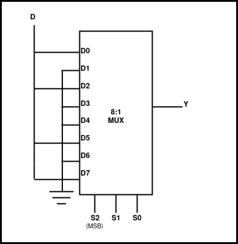
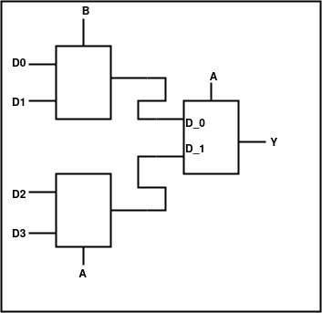

## Post test
<pre> 
1) The 2:1 multiplexer using basic logic gates with active low enable input can be build using:
<b>a. Two AND, Two NOT, One OR gates</b>
b. Two AND, One NOT, One OR gates
c. Two AND, Two NOT, Two OR gates
d. One AND, Three NOT, One OR gates

2) Select the output when S2= S1 = 1 and S0 = 0.

<b>a.Y = 0</b>
b.Y = 1
c.Y = D
d.None of these

3) Identify the circuit shown below.

a.2:1 Mux
<b>b.4:1 Mux</b>
c.6:1 Mux
d.8:1 Mux

4) Design, construct and verify a 2:1 Mux using basic logic gates. Get the simulation results evaluated from your faculty.

5) Differentiate between multiplexer and encoder?

</pre>