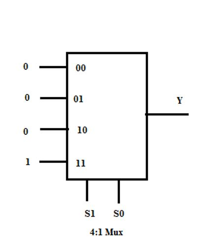

## <b> Pre-test</b>
#### Please attempt the following questions
<pre>
1) A multiplexer is a ___________
a.data selector/multi-position switch.
b.parallel to serial converter.
c.design alternative to sum-of-product solutions.
<b>d.All of these</b>

2) How many select lines are required for a 32: 1 Mux?
a.Two
b.Four
<b>c.Five</b>
d.Eight

3) Any n-variable truth table can be implemented using a universal logic circuit referred to as multiplexer. State True or False.
<b>a.True</b>
b. False

4) The enable input in a multiplexer is also referred to as________
a.decode input
<b>b.strobe input</b>
c.Select input
d.All of these

5) For the circuit shown below, input S1 = 1, S0 = 0, then the output is_____

<b>a.Y = 0</b>
b.Y = 1
c.Y - X
d.None of these

</pre>