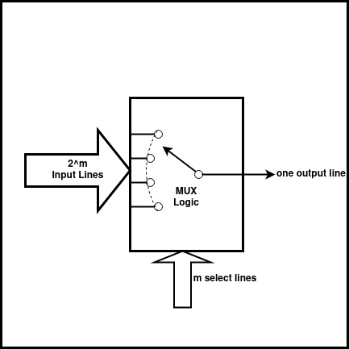
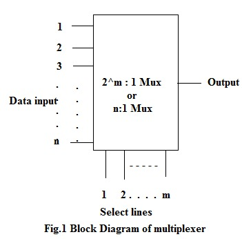
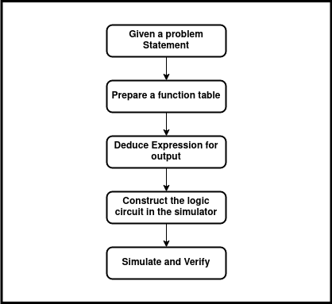
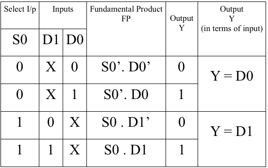
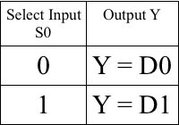
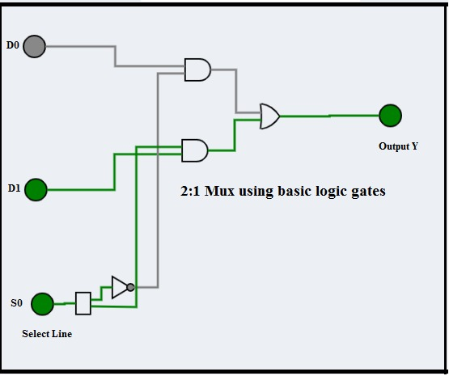
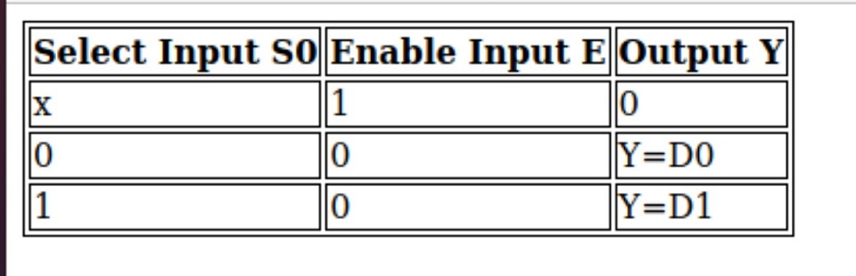
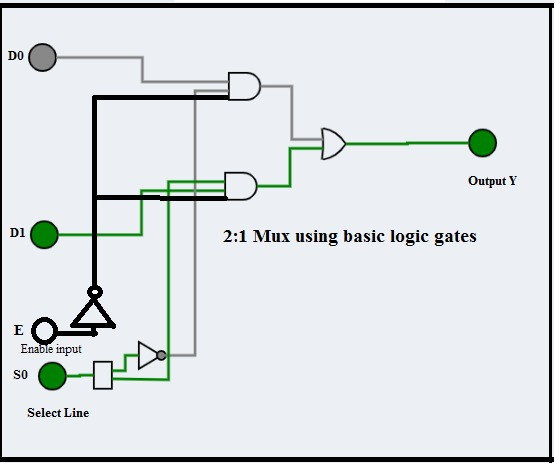
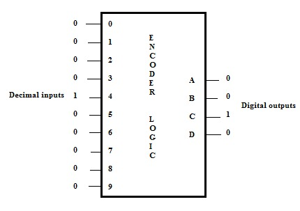

<justify>

**1.1 Introduction** 
A digital multiplexer is similar to a multi-position switch with many inputs and only one output. It has control inputs to select a particular input. It is also called as a channel selector and abbreviated as Mux.

 

 

A multiplexer has m select lines, 2^m inputs and only one output as shown in the figure.
Commercially, multiplexers ICs(integrated circuits) are available in powers of 2, e.g. 2:1, 4:1, 8:1 and 16:1 Mux.

| No.of select lines (m) | No.of inputs (2^m) | No. of  Outputs Y | Multiplexer Type |
|:----------------------:|:------------------:|:-----------------:|:----------------:|
|            1           |          2         |         1         |        2:1       |
|            2           |          4         |         1         |        4:1       |
|            3           |          8         |         1         |        8:1       |
|            4           |         16         |         1         |       16:1       |

 

 

It is easier to build multiplexers using gates (small scale integration -SSI ICs) for a few select lines. But as the number of select lines increases, use of medium scale integration MSI ICs becomes the best choice. TTL IC 74LS150 is a 16:1 Mux.
In this experiment design of smaller size Muxes are considered.
A 2:1(read as 2 as to 1) multiplexer can be designed using:
a.	basic logic gates
b.	universal gates (NAND & NOR).

**1.2.Example 1**: Design of 2:1 Mux using basic logic gates
A simple 2:1 Mux will have 2 input lines D0 & D1 and one select line S0 and a single output Y.
The select line can take a value either 0 or 1:
a.	If S0 takes a value 0, the input D0 is selected and the output Y = D0. 
b.	If S0 takes a value 1, the input D1 is selected and the output Y = D1.
 
**1.2.1 Theoretical Design**: 
The flow diagram explains the steps involved in the design of the circuit: 

 

 

Apply these steps to design a 2:1 Mux using logic gates:
 
**a.	Prepare the function table of the 2:1 Mux:**

 

 

**b.  Formulate the expression for output Y by considering only those FPs for which the output is 1.
Y = S0’. D0 + S0 . D1
The simplified function can be tabulated as:**

 

 

**c. Draw the logic diagram for the expression:**

 

 

**d. Using simulator construct the circuit and verify its operation.**

**e. The same circuit can also be designed by having an active low enable input as shown in image.
The simplified function can be tabulated as:**
 

 

 

 

**1.3. Encoder Logic**
The figure shows the concept of encoder wherein input line 4 is high and all other inputs are low. The output of the encoder is a decimal 4, whose equivalent binary is 0100.
The concept of decimal to binary(10 to 4 binary) encoder is shown in the figure given below. On similar lines an octal-binary encoder will have eight inputs and produce 3-bit binary output.
 

</justify>