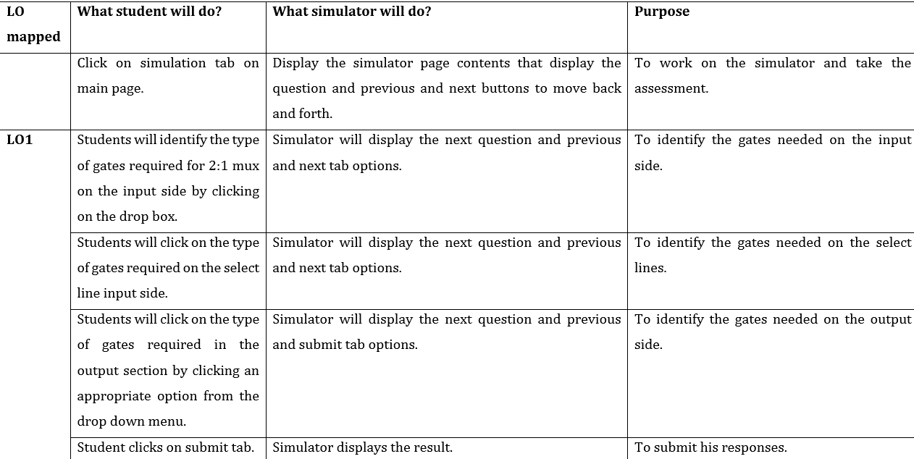
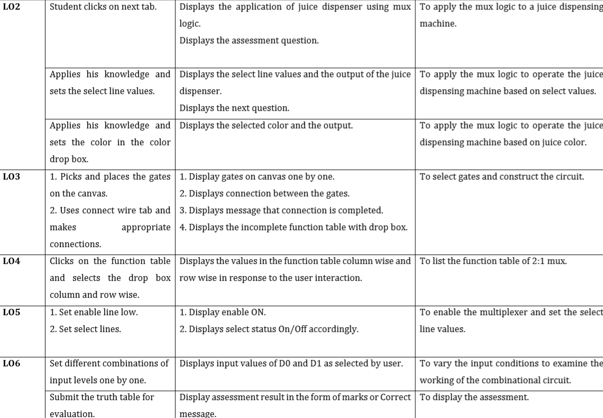

# Round 1 - Pedagogy
**Name of Faculty**: Prof. Mrs Tanuja Sachin Khatavkar  
**Institute**: PVG’s College of Engineering & Technology, Pune-09  
**Email ID**: tanutsk@gmail.com  
**Discipline to which the Lab belongs**: Electronics & Telecommunication  
**Name of the Lab**: Digital Logic Design Using Gates  
**Name of Experiment**: Design of multiplexer circuits using basic logic gates.

  Kindly refer these documents before filling the worksheet  

**1. Guidelines :**  
a.  Handout for R1 Overall Summary : http://bit.ly/Vlabs-Dev_Handout_Summary_R1  
b. Handout R1 for topics 1 & 2 : http://bit.ly/Vlabs-Dev_Handout_1_R1  
c. Handout R1 for topics 3 & 4:  http://bit.ly/Vlabs-Dev_Handout2_R1  
d. Presentation  on Learning Objectives: http://bit.ly/Vlabs-Dev_LO-ppt  

**2. Samples of R1 :**

a. Fluid-Mechanics: : http://bit.ly/Fluid-Mech_R1_Sample  
b. Digital-Electronics-Lab:  http://bit.ly/Digital_elec_R1_Sample  
c. Numerical-Methods-Lab:  http://bit.ly/Numerical-Method_R1_Sample  

## 1.1. FOCUS AREA: Experimentation

### 1.2. About the Experiment:
The experiment is developed to provide a virtual platform to the students to learn the basics of multiplexer circuits and perform experimentation such as the implementation of multiplexer using  Basic Gates.

### 1.3. Learning Objectives & Cognitive Levels:

|Sr no. | Learning Objective | Cognitive level |Action Verb |
|-------|--------------------|-----------------|------------|
|1.|Students will identify the type of gates required for 2:1 mux.| Remember | Identify |
|2.|Students will be able to identify the role of a multiplexer circuit.| Apply | Identify|
|3.|Students will be able to construct the 2:1 multiplexer.| Apply | Construct |
|4.|Students will be able to build the function table of 2:1 multiplexer.| Apply | build |
|5.| The student will be able to apply appropriate combinations of enable, select and inputs to the 2:1mux circuit. | Apply | Apply |
|6.|The student will be able to examine the operation of a 2:1 multiplexer using basic logic gates.| Analyze | Examine |

## 2.1. Instructional Strategy : Problem based

### 2.2. Assessment Method : Formative Assessment
### 2.3. Description of sections:
It is proposed to design this experiment using a simulator with a framework that provides logic gates, switches, LEDs and wire options, reset, undo wire and undo gate, simulate and pick and place features. These features would enable the students to construct, simulate and examine the functions of 2:1 multiplexer.

### 3. Task & Assessment Questions
Complete the following table with details of the various tasks and assessment questions you will give to the students.

|Sr No.| Learning Objective to be met| Tasks to be performed by the students | Assessment questions aligned to the task |
|------|-----------------------------|--------------------------------------------|-------------------------------------|
|1.| Students will identify the type of gates required for 2:1 mux.| Student will select the appropriate gates and submit them..| Assessment question based on identifying the gates to be connected on input side, output side and control lines are to be asked.|
|2.|Students will be able to identify the role of a multiplexer circuit.| Student clicks on the select line tab for each question. He selects an appropriate combination and submits the values assigned to select lines. |An application/problem of juice dispensing machine is given to the student. Questions based on the function table will to be asked.|
|3.|The student will be able to construct and verify the operation of a 2:1 multiplexer using basic logic gates.| Student will do appropriate connections of the gates to form a combinational circuit. | Make the connections to construct the circuit of 2:1 mux.|
|4.| Students will be able to build the function table of 2:1 multiplexer. | 1. Student will input the function table of multiplexer.   2. Student will identify the Boolean expression for the output. | 1. Complete the function table.  2. Select the appropriate Boolean expression for the circuit from the drop box.|
|5.| The student will be able to apply appropriate combinations of enable, select and inputs to the 2:1mux circuit. | 1. Set enable line low.   2. Set select lines.  3. Set input levels. | Change the control and input conditions for the combinational circuit for functional verification |
|6.| The student will be able to examine the operation of a 2:1 multiplexer using basic logic gates. | Student will simulate, observe and analyze the results. | To analyze the simulation output against the function table generated. |

## 4. Simulator Interactions

 
 
